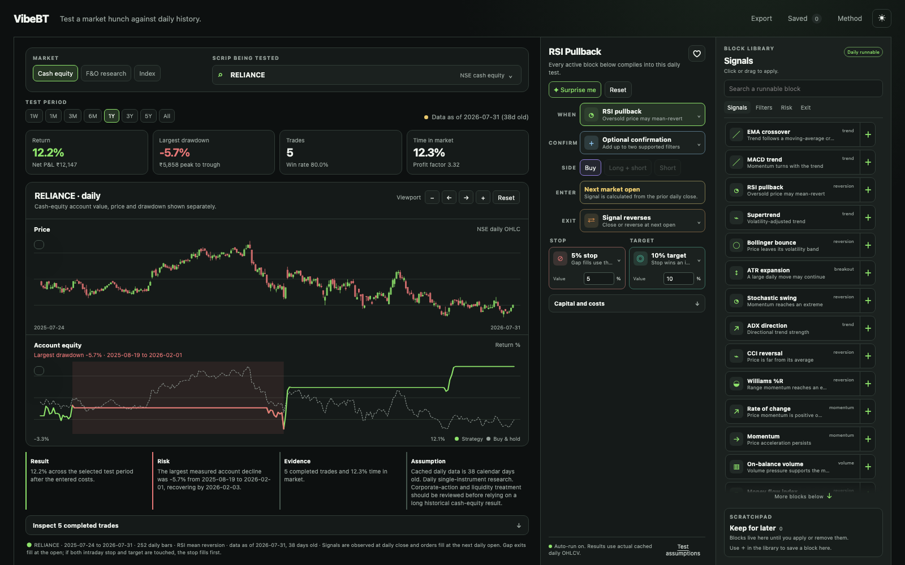

# VibeBT

### Drag, drop and test a market hunch

VibeBT is a playful visual backtester for Indian-market ideas. Pick an NSE equity, drag a few simple blocks into place, and watch that pattern play out across real daily candles.

There is no strategy language to learn and no formula editor to fight. You build a pattern the way you describe it: **when this happens**, **check that**, **buy or sell**, then **get out here**.

> **Simple patterns, real candles.** VibeBT runs your blocks on observed daily OHLCV data with next-open fills and configurable costs.



_One screen. Pull a block from the right, drop it into a pattern, and see the result on the left._

## Make a pattern in seconds

```text
Drag “RSI pullback”      →  WHEN
Drag “Above 50 SMA”      →  CONFIRM
Pick “Buy”               →  SIDE
Drag “5% stop”           →  STOP
Drag “10% target”        →  TARGET
```

The chart regenerates as you build. Change the stock or test period whenever you like, then keep the interesting combinations in the scratchpad.

## What you can do

| Pick a simple idea | Drag it into place | Watch the story unfold |
| --- | --- | --- |
| Choose an NSE cash equity and test period | Drag or click a signal, confirmation, exit, stop or target | Read candle, equity and drawdown charts with hover values |
| Start with familiar patterns such as EMA cross, RSI pullback or Bollinger bounce | Adjust EMA, MACD, stop and target values inside the blocks | Review fills, fees, slippage, metrics and individual trades |
| Keep “maybe later” blocks in the scratchpad | Name and save combinations you like | Export the complete experiment as JSON |

The chart stays central, while the builder, block library and scratchpad remain within reach. It should feel closer to a creative desk than a trading terminal.

## Feature tour

### Drag and drop is the main interaction

Every block has one job. Signals answer **when** to pay attention. Confirmations add a simple check. Stops, targets and exits shape what happens after entry. Drag a block from the library into its matching slot, or click it when you are moving quickly.

The library stays open beside the pattern. The scratchpad stays below it. You never need to leave the workspace to find another ingredient.

### Start with patterns you already know

VibeBT is designed around small, understandable combinations: an EMA crossover with a trend filter, an RSI pullback with a target, or a Bollinger bounce with a stop. You can change the numbers inside a block, while the shape of the idea remains easy to read at a glance.

### Chart-first wandering

The price chart uses daily candlesticks, never smoothed presentation curves. Hover a bar to see its date, OHLC values, account equity, drawdown and related trade activity. Zoom, pan and reset the viewport without changing the test.

### Your pattern stays readable

The builder follows one short flow: **when** a signal occurs, **confirm** it, choose the trade side, enter at the next open, then define an exit, stop and target. EMA and MACD settings, plus stop and target values, live inside their relevant blocks.

### A library for playful combinations

Signals, confirmations, risks and exits are grouped in one scrollable library. The always-visible scratchpad holds possibilities worth returning to later.

### A quick story about the run

The results panel surfaces return, largest drawdown, trade count and time in market. The chart highlights the complete peak-to-trough drawdown interval, while the notes explain the result, risk and assumptions in context.

### Keep and share your experiments

Set commission and slippage in basis points, save named ideas locally, and export a run with its exact strategy, source metadata, metrics, bars and trades. Each result includes its data-as-of date.

## Run it locally

You need Node.js 22+ and Python 3.12+.

```sh
git clone https://github.com/ajitcsn/vibebt.git
cd vibebt
npm install
python3 -m pip install -r requirements.txt
npm run data
```

Open [http://localhost:8765](http://localhost:8765). One service serves the workspace and backtesting API together.

### Refresh the official NSE snapshot

The repository includes a reproducible daily snapshot for 19 liquid equities. To refresh the default universe from NSE's current UDiFF bhavcopy archives:

```sh
npm run data:nse
```

Restart `npm run data` after a refresh. The importer records every archive URL, UTC fetch time and SHA-256 checksum in `data/nse_daily/manifest.json`.

Try a smaller custom import first:

```sh
npm run data:nse -- --days 30 --symbols RELIANCE,INFY,TCS
```

## How a test works

```text
Completed daily bar
       ↓
Strategy and filters observe its known values
       ↓
Order fills at the next daily open
       ↓
Daily high/low checks stop and target
       ↓
Equity, benchmark, drawdown and trades are recorded
```

The sandbox has a few ground rules:

- Signals are observed at the completed close and fill at the following open.
- Slippage and commission apply on both sides of every fill.
- A gap through a stop or target fills at the open.
- When a daily bar reaches both stop and target, the stop takes priority.
- Cash equities and indices are long-only in the current daily engine.
- A visible block runs only when it has an exact registered compiler.

See [BACKTEST_CONTRACT.md](BACKTEST_CONTRACT.md) for the detailed execution contract and [MARKET_REALITY.md](MARKET_REALITY.md) for data principles.

## Data sources

### Official NSE cash equities

The default source is NSE's CM UDiFF Common Bhavcopy Final archive. VibeBT imports the `EQ` series only and keeps each symbol in a separate, provenance-tagged file. The visible scrip picker labels these instruments **Cash equities · NSE official**.

The data is end-of-day OHLCV. Splits, bonuses, dividends, liquidity and symbol changes can affect a long-history result. VibeBT shows the data date and source alongside each run.

### Optional local broker cache

If you have the companion `kite-futures-cache` project, VibeBT can also expose its cached indices and continuous-futures research series. Those instruments remain separate from official NSE equity files.

Read [DATA_SOURCES.md](DATA_SOURCES.md) for source provenance and scope.

## Simple patterns to play with

VibeBT currently has 20 runnable daily pattern families. Start with the familiar ones and combine them gently:

EMA crossover, MACD, RSI, Supertrend, Bollinger Bands, ATR expansion, Stochastic, ADX, CCI, Williams %R, rate of change, momentum, OBV, MFI, Donchian Channels, Keltner Channels, SMA crossover, Ichimoku, Parabolic SAR, and buy-and-hold.

The block library can hold more ideas as it grows. Each runnable pattern has a matching compiler, so the chart always reflects the blocks you chose.

## Deploy it

`render.yaml` and the multi-stage `Dockerfile` deploy the UI, API and committed NSE snapshot as one service. This is the shortest hosted setup:

1. Create a Render web service from this repository.
2. Select the Blueprint and its free plan, or a small always-on plan.
3. Render builds the Docker image and exposes one URL for the whole workspace.

The free plan sleeps after 15 idle minutes. For an always-on personal instance, an Oracle Cloud Always Free VM is a good first option; a 1–2 GB VPS is the simple paid fallback.

## Development checks

```sh
npm run verify
```

This validates all registered compilers, execution rules and the production frontend build.

## A quick reality check

VibeBT currently works one daily instrument at a time. Point-in-time universes, fully corporate-action-adjusted history, tradable futures rolls, margin models, intraday execution and order routing are outside its current playground.

Enjoy the experiments. For real decisions, take time to check the source data, assumptions, liquidity, robustness and out-of-sample behaviour.

## Contributing

Contributions are welcome, especially for source adapters with clear licensing and provenance, point-in-time corporate-action handling, fully specified strategy compilers, reproducible verification cases, and accessibility improvements.

Please keep the core promise intact: every visible result should trace back to actual market data and clear execution assumptions.

## License

License selection is pending. Do not redistribute market data beyond the terms of its original provider.
